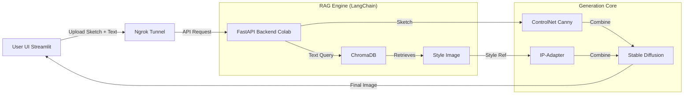

# 🎨 Generative Design RAG Engine
> **Decoupling Style from Structure:** A Multimodal RAG system that transforms sketches into high-fidelity renders without hallucinating geometry.


---

## 🖼️ Demo (Before vs. After)

| Input (User Sketch) | Style Reference (RAG Retrieved) | Output (Generated Design) |
| :---: | :---: | :---: |
|  |  |  |

> *The system retains the exact geometry of the input sketch (via ControlNet) while applying the texture and lighting of the retrieved style (via IP-Adapter).*

---


## 💡 The Project: Multimodal RAG Architecture
This engine uses a **Retrieval-Augmented Generation (RAG)** workflow to "paint" styles onto "locked" structures.

### 1. The Knowledge Base (RAG) 🧠
* We utilize **ChromaDB** to store vector embeddings of curated design styles (Cyberpunk, Ghibli, Industrial, etc.).
* Using **CLIP Embeddings**, the system performs **Semantic Search**. A user can type *"Spooky gothic castle"*, and the RAG engine retrieves the most mathematically similar visual reference from the database.

### 2. The Generation Pipeline (Hybrid Control) 🎨
* **Structure Lock (ControlNet):** The input sketch is processed using **Canny Edge Detection**. ControlNet forces the Diffusion model to align pixels strictly to these edges.
* **Style Injection (IP-Adapter):** The *retrieved* image from step 1 is fed into an **IP-Adapter**. This modifies the UNet's attention layers to mimic the color palette and texture of the reference.

---

## 🛠️ Tech Stack

* **Orchestration:** [LangChain (LCEL)](https://python.langchain.com/) for managing the retrieval-generation chain.
* **Vector Database:** [ChromaDB](https://www.trychroma.com/) for multimodal embedding storage.
* **Generative Models:**
    * Stable Diffusion v1.5 (Base)
    * ControlNet (Canny)
    * IP-Adapter (Style Transfer)
* **Backend API:** FastAPI (running on Google Colab GPU).
* **Tunneling:** Ngrok (exposes the Colab localhost to the web).
* **Frontend:** Streamlit.

---

## 🏗️ Architecture Diagram



## ⚡ Installation & Setup

This project follows a **Client-Server Architecture**. The heavy AI processing runs on a Cloud GPU (Google Colab), while the interactive UI runs locally on your machine.

### Prerequisites
* **Python 3.10+** installed on your local machine.
* A **Google Account** (to use Google Colab).
* An **Ngrok Account** (free) for secure tunneling.

---

### 1. ☁️ Backend Setup (The "Brain")
*We run the backend on Google Colab to leverage the free T4 GPU.*

1.  **Open the Notebook:** Upload the `backend_notebook.ipynb` file to Google Drive and open it with [Google Colab](https://colab.research.google.com/).
2.  **Enable GPU:** Go to **Runtime** > **Change runtime type** > Select **T4 GPU**.
3.  **Add Ngrok Token:**
    * Sign up at [dashboard.ngrok.com](https://dashboard.ngrok.com).
    * Copy your **Authtoken**.
    * Paste it into the `NEW_TOKEN` variable in the notebook code.
    --
    

4.  **Run All Cells:** Execute the notebook. It will install dependencies, download models (approx. 5GB), and start the server.
5.  **Copy the URL:** At the end of the logs, copy the public URL (e.g., `https://a1b2-34...ngrok-free.app`).

---

### 2. 💻 Frontend Setup (The UI)
*Run this on your local computer's terminal (VS Code, CMD, or Terminal).*

1.  **Clone the Repository:**
    ```bash
    git clone [https://github.com/yourusername/generative-design-rag.git](https://github.com/yourusername/generative-design-rag.git)
    cd generative-design-rag
    ```

2.  **Create a Virtual Environment (Optional but Recommended):**
    ```bash
    # Windows
    python -m venv venv
    venv\Scripts\activate

    # Mac/Linux
    python3 -m venv venv
    source venv/bin/activate
    ```

3.  **Install Dependencies:**
    ```bash
    pip install -r requirements.txt
    ```

4.  **Run the App:**
    ```bash
    streamlit run app.py
    ```

5.  **Connect:**
    * The Streamlit app will open in your browser (`localhost:8501`).
    * Paste the **Ngrok URL** (from Step 1) into the sidebar input field.
    * Start generating!
